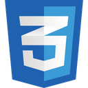
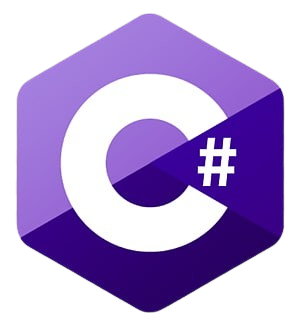

<h2 align="center">👋 E aí, eu sou o Ismael</h2>

  Programador em aprendizado contínuo. 
  Projetos simples, reais e funcionais.

  
  
  
  
  

  <i>HTML • CSS • Python • C# • C++</i>

  📌 Este GitHub é meu espaço de estudo e evolução.

